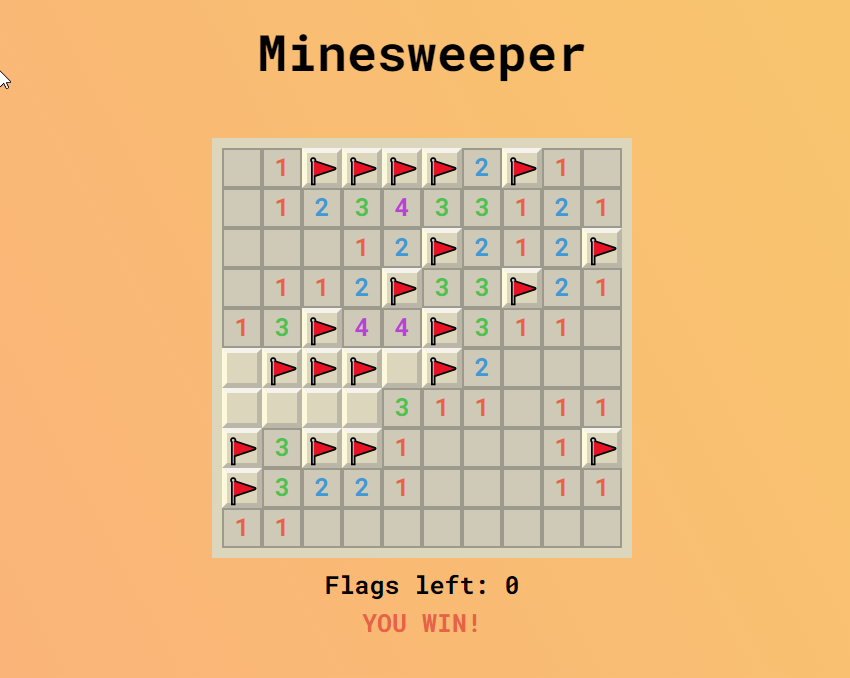

# Minesweeper Game

Minesweeper is a puzzle game. The objective of the game is to clear a rectangular board containing hidden "mines" or bombs without detonating any of them, with help from clues about the number of neighboring mines in each field.

## Screens

## LIVE URL
See [here](https://h4haris.github.io/minesweeper-game) 

## Game Rules

- In Minesweeper, mines are scattered throughout a board, which is divided into cells. Cells have three states: unopened, opened and flagged. An unopened cell is blank and clickable, while an opened cell is exposed. Flagged cells are those marked by the player to indicate a potential mine location.

- A player left-clicks a cell to open it. If a player opens a mined cell, the game ends, as there is only one life per game. Otherwise, the opened cell displays either a number, indicating the number of mines diagonally and/or adjacent to it, or a blank tile (or "0"), and all adjacent non-mined cells will automatically be opened. 

- Right-clicking on a cell will flag it, causing a flag to appear on it. Flagged cells are still considered unopened, and a player can click on them to open them, although typically they must first be unflagged with an additional right-click.

- Game begins when the player makes the first click on a board with all cells unopened.

- During the game, the player uses information given from the opened cells to deduce further cells that are safe to open, iteratively gaining more information to solve the board. 

- The player is also given the number of remaining flags in the board, known as the minecount, which is calculated as the total number of mines.

- Frequently when playing the game, the player encounters situations when they cannot deduce any further safe cells from the information given so they would need to make a guess.

- To win the game, players must open all non-mine cells while not opening any mines. Or Flagging all the mined cells.

### Reference
https://www.youtube.com/watch?v=rxdGAKRndz8
